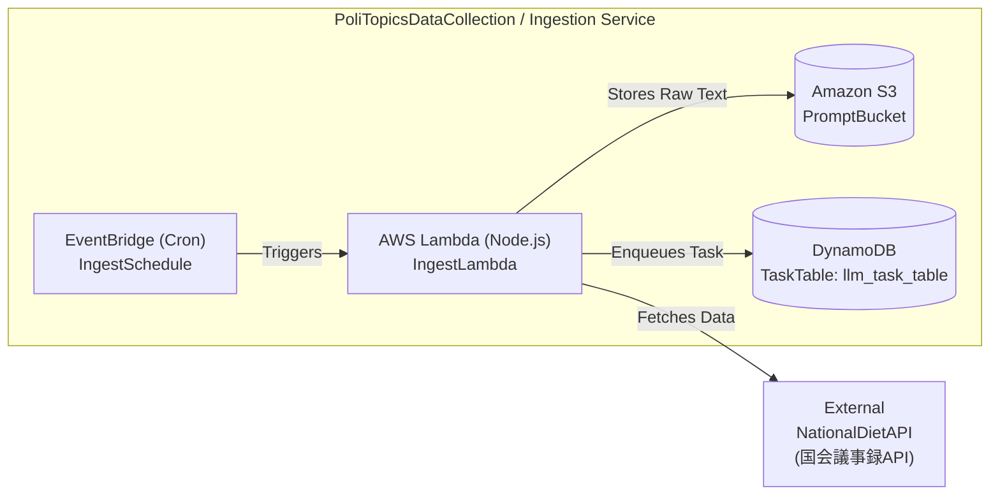
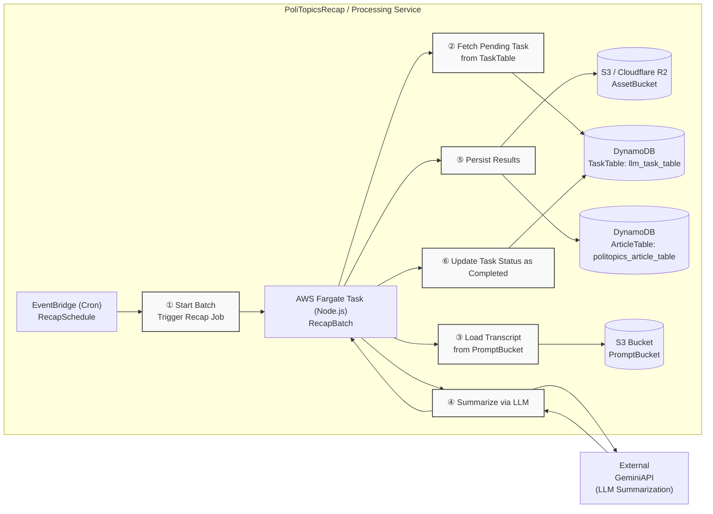
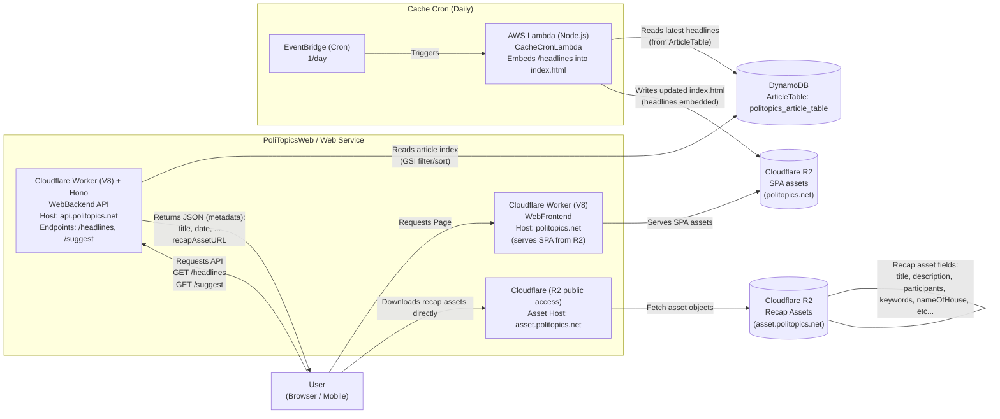

# 5. System Diagram
[日本語版](./jp/05_system_diagram.md)

## Component map
- PoliTopicsDataCollection (AWS Lambda + API Gateway + EventBridge)
- PoliTopicsRecap (AWS Fargate + EventBridge Scheduler)
- PoliTopicsWeb (Cloudflare Workers V8 + Hono backend API, Next.js SPA on Cloudflare R2)
- DynamoDB (LLM task table, article table)
- Amazon S3 (prompt bucket)
- Cloudflare R2 (article asset bucket, SPA assets)
- External APIs (National Diet API, Gemini API)

## Mermaid diagrams

### DataCollection

### Recap

### Web

## Data flow (text)
1) National Diet API -> DataCollection Lambda
2) DataCollection Lambda -> R2 (prompts)
3) DataCollection Lambda -> DynamoDB LLM task table
4) Recap Fargate -> R2 (chunk/reduce results)
5) Recap Fargate -> DynamoDB article table + R2 article assets (public/signed URLs)
6) Web backend (Cloudflare Workers V8 + Hono) -> DynamoDB + R2 assets
7) Web frontend -> Web backend API and direct R2 asset fetch

## Network and infra
- AWS-managed services (Lambda, Fargate, DynamoDB, API Gateway, EventBridge/Scheduler) plus Cloudflare Workers/R2 for serving.
- Local development uses LocalStack for DynamoDB, Lambda, and API Gateway; Workers and R2 use their dev tooling or S3 API endpoints.

## Environment-specific configuration
- Local: LocalStack endpoints, test credentials, local table/bucket names, and Workers dev config.
- Stage/Prod: AWS endpoints, Cloudflare production accounts, stage/prod table/bucket names.
- See `docs/system_overview.md` and each module `config.ts` for exact names.
