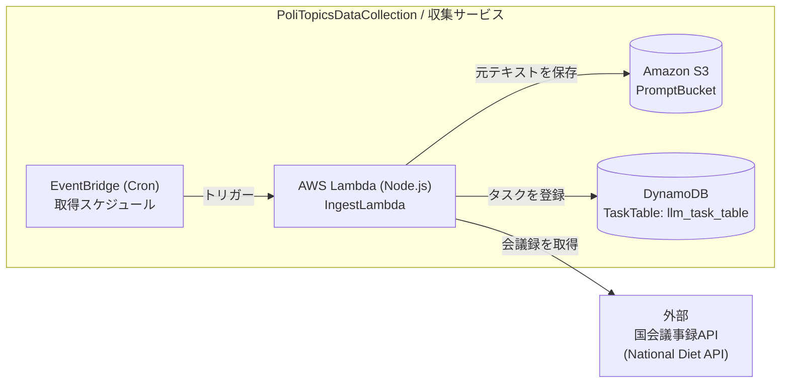
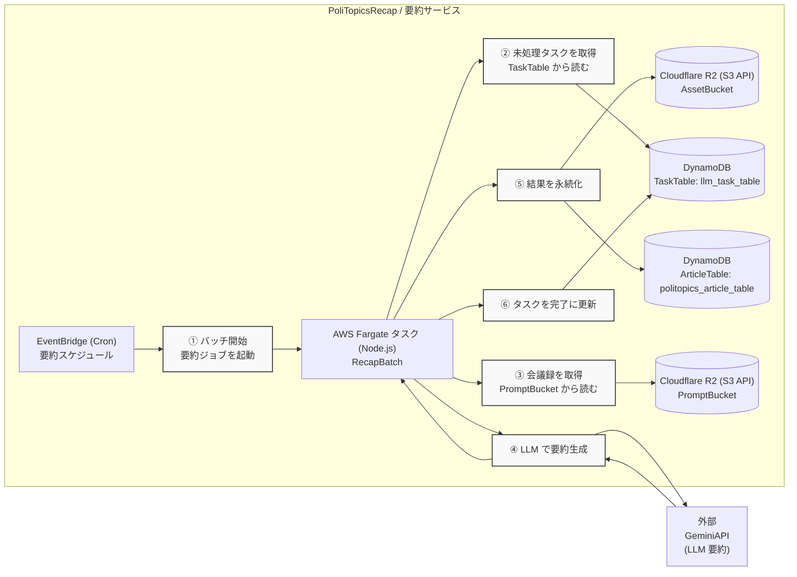
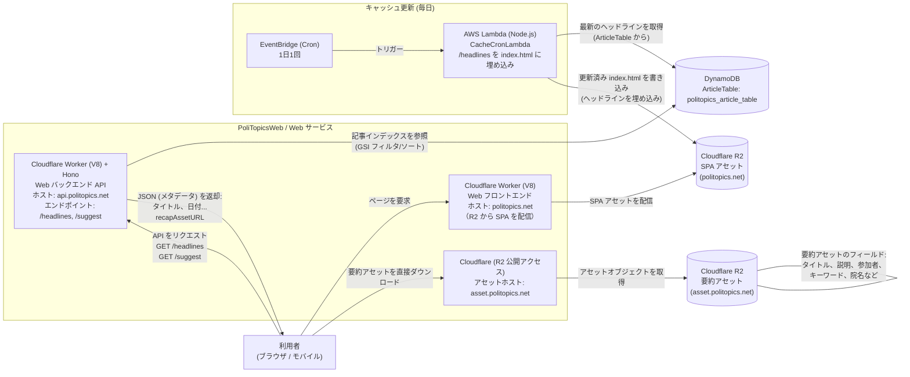

# 5. システム図
[English Version](../../docs/05_system_diagram.md)

## コンポーネントマップ
- PoliTopicsDataCollection (AWS Lambda + API Gateway + EventBridge)
- PoliTopicsRecap (AWS Fargate + EventBridge Scheduler)
- PoliTopicsWeb (Cloudflare Workers V8 + Hono バックエンド API、Cloudflare R2 上の Next.js SPA)
- DynamoDB (LLM タスクテーブル, 記事テーブル)
- Amazon S3 (プロンプトバケット)
- Cloudflare R2 (記事アセットバケット, SPA アセット)
- 外部 API (国会 API, Gemini API)

## Mermaid 図

### DataCollection

### Recap

### Web

## データフロー (テキスト)
1) 国会 API -> DataCollection Lambda
2) DataCollection Lambda -> R2 (プロンプト)
3) DataCollection Lambda -> DynamoDB LLM タスクテーブル
4) Recap Fargate -> R2 (チャンク/リデュース結果)
5) Recap Fargate -> DynamoDB 記事テーブル + R2 記事アセット（公開/署名付き URL）
6) Web backend (Cloudflare Workers V8 + Hono) -> DynamoDB + R2 アセット
7) Web frontend -> Web backend API と R2 アセットの直接取得

## ネットワークとインフラ
- AWS マネージドサービス (Lambda, Fargate, DynamoDB, API Gateway, EventBridge/Scheduler) と Cloudflare Workers/R2 を併用。
- ローカル開発は DynamoDB, Lambda, API Gateway に LocalStack を使用し、Workers と R2 は dev ツールまたは S3 API エンドポイントを使用。

## 環境固有の設定
- Local: LocalStack エンドポイント、テスト認証情報、ローカルのテーブル/バケット名、Workers の dev 設定。
- Stage/Prod: AWS エンドポイント、Cloudflare 本番アカウント、ステージ/本番のテーブル/バケット名。
- 正確な名前は `docs/jp/system_overview.md` と各モジュールの `config.ts` を参照。
